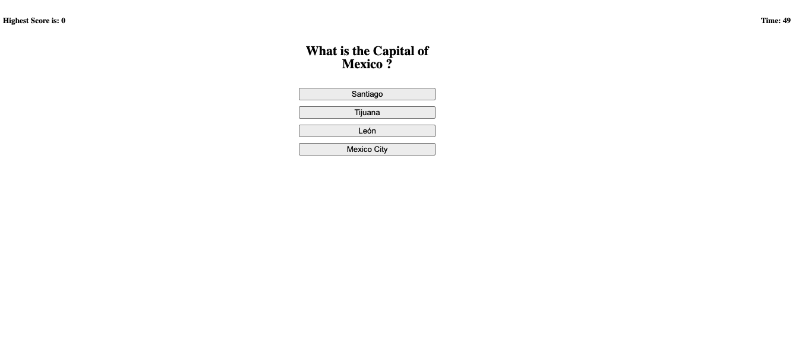
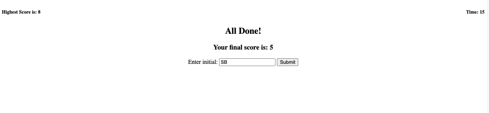
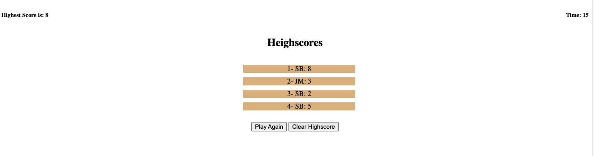

# 04 Web APIs: Code Quiz
## Saghar Behinaein 
## Your Task

At some point in your journey to become a full-stack web developer, you’ll likely be asked to complete a coding assessment&mdash;perhaps as part of an interview process. A typical coding assessment includes both multiple-choice questions and interactive coding challenges. 

To help familiarize you with these tests and allow you to use the skills covered in this unit, this week’s homework invites you to build a timed coding quiz with multiple-choice questions. This app will run in the browser and will feature dynamically updated HTML and CSS powered by JavaScript code that you write. It will have a clean, polished, and responsive user interface. 

This week’s coursework will equip you with all the skills you need to succeed in this assignment.

## User Story

```
AS A coding boot camp student
I WANT to take a timed quiz on JavaScript fundamentals that stores high scores
SO THAT I can gauge my progress compared to my peers
```

## Acceptance Criteria

```
GIVEN I am taking a code quiz
WHEN I click the start button
THEN a timer starts and I am presented with a question
WHEN I answer a question
THEN I am presented with another question
WHEN I answer a question incorrectly
THEN time is subtracted from the clock
WHEN all questions are answered or the timer reaches 0
THEN the game is over
WHEN the game is over
THEN I can save my initials and my score
```

## Mock-Up

The following animation demonstrates the application functionality:


## My Work
* The first page is the start page which has the start quiz button. by
clicking it, the quiz will start. also, this page has a timer on the top right
corner which starts as soon as you click the start button and it counts
down from 60 seconds. on the top right corner pick the highest score
from local memory. if it's the first time it's equal to 0.


* When the Srat Quiz pressed. the question with the answers will load to the page. 



  * if the answer is correct, it shows a correct message
  
  
  * if the answer is wrong, it shows a wrong message and subtracted the timer by 10
  

* By answering a question, then it presented with another question

*  WHEN all questions are answered or the timer reaches 0, THEN the game is over and the timer will stop and the user can see the result and ask the user to inter her/his initial
 

*  After clicking the submit button, the initial and score willo save in the local storage and it show the scores in the result page 
   

*  the Clear Highscore clear all the rowws and by Play Again button, user can play the gaim again and timer will set to 0 again 
  

*  GitHub repository name: HW-Code-Quiz-April-05
*  The URL to the website is: https://saghar-b.github.io/HW-Code-Quiz-April-05/
*  The URL of the GitHub repository : https://github.com/saghar-b/HW-Code-Quiz-April-05
